# 数字水墨与诗意视听

这组作品围绕中国绘画与诗歌的空间、节奏和留白展开。《水墨小品》让观众直接落笔，《千里江山·活卷》和《汴京一日》让画卷随时间展开，《春江花月夜》和《所剩沾衣》则把文字、景物与声音组织在同一画面中。

## 核心技术

主要画面由 Canvas 2D 绘制。JavaScript 将山体、建筑、树木、水面和笔触拆成可组合的绘画步骤，并通过 requestAnimationFrame 持续更新。分层画布、噪声与随机采样用于形成纸张颗粒、山石起伏和墨色变化。

交互由鼠标、触摸和键盘事件驱动。《水墨小品》根据移动速度及手写笔压力调整笔触，以多条笔毫轨迹和墨量衰减表现浓淡、枯笔与飞白，并提供撤销、印章和图片保存。《千里江山·活卷》包含游卷、入画、作画过程、昼夜切换和局部探索；《汴京一日》把绘画步骤组织为生长动画，再用送货人的行程串联街市故事。

声音采用两种方式。《春江花月夜》等页面通过 Web Audio API 实时生成环境声和乐音，其中《春江花月夜》使用延迟反馈式拨弦合成与混响，营造弦乐和江水氛围。《所剩沾衣》播放内嵌音频，以音频时间定位歌词并更新高亮；它的视觉动画随播放状态变化，不是对音频频谱的实时分析。

## 作品与效果

| 作品 | 呈现与交互 |
| --- | --- |
| 水墨小品 | 速度和压感改变笔触，墨量减少后出现飞白；可选择墨色、干湿度，观看山水、墨竹和梅花示范。 |
| 千里江山·活卷 | 青绿山水、舟桥与人物构成可游览的长卷，支持观作画、入画、局部探索、昼夜和声音切换。 |
| 汴京一日 | 地形、梁柱、屋舍、淡彩与人物逐步成形；自动导览和自由游卷连接不同的观看节奏。 |
| 春江花月夜 | 十八组诗句与月色、江潮、落花、舟船等场景变化相配合；点击江面产生涟漪，移动指针影响风与花。另附约 5 分 58 秒的 720p 视频。 |
| 所剩沾衣 | 月夜山水、霜粒与水中倒影配合古风歌曲，提供歌词跟随、逐句跳转与时间偏移调整。 |

## 观看方式

下载后打开 HTML 文件。长卷作品适合横屏；触发声音需要先点击页面。《春江花月夜》的 MP4 是视频观看版本，不包含网页交互。

《汴京一日》是受《清明上河图》启发的程序绘制原创长卷，其人物故事为艺术虚构。《千里江山·活卷》中的作画过程属于数字演绎。

## 图文导览

每个展示入口配 2–3 张实拍截图或视频截帧。图注说明当前内容、可观察的效果与体验方法；动态图的截图仅代表一个时刻。

### 水墨小品

这是可以亲自落笔的水墨画布。Canvas 2D 将笔毫轨迹、墨量和纸张质感组合起来；移动速度、压感及枯润设置改变笔触。先看示范理解浓淡与留白，再清纸作画，可撤销、盖印和保存。

**图 1｜山水示范：墨色与留白**

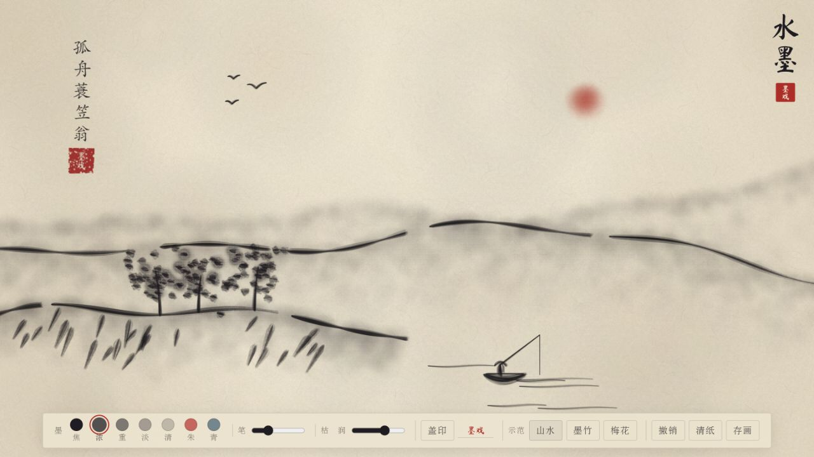

远山用淡墨铺开，近处树木、舟船和岸线以较重笔触勾画。下方保留墨色、笔宽、枯润及盖印工具，展示同一画布如何兼顾观看与创作。

**图 2｜墨竹示范：笔触构成形态**

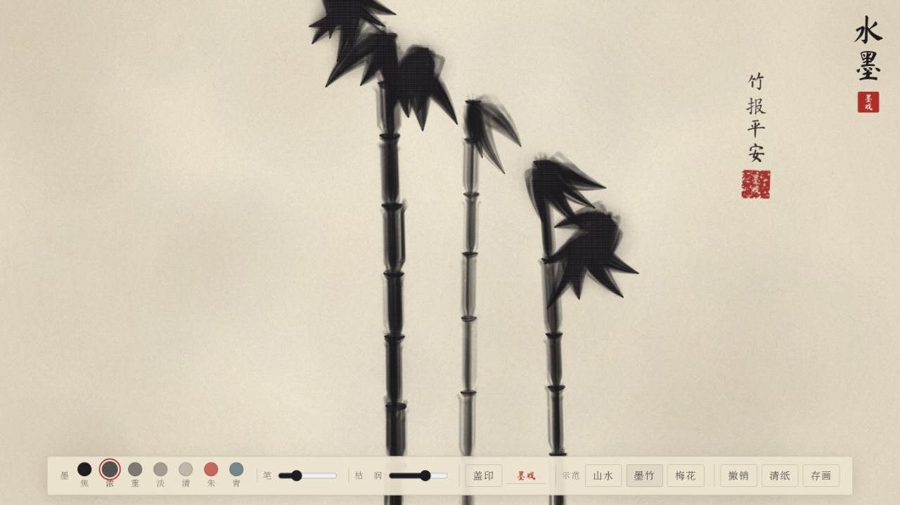

竹竿与竹叶采用不同粗细和方向的笔触，纸张纹理仍透过墨色可见。可对照山水示范，观察程序笔刷如何表现不同题材。

### 千里江山·活卷

青绿山水由分层 Canvas 程序绘制，前后山体、岛屿、树木和水面共同形成空间深度。截图采用“入画”视角；还可以展卷、自动游览、观看数字作画过程，并切换昼夜。

**图 1｜清晨入画：青绿山水的层次**

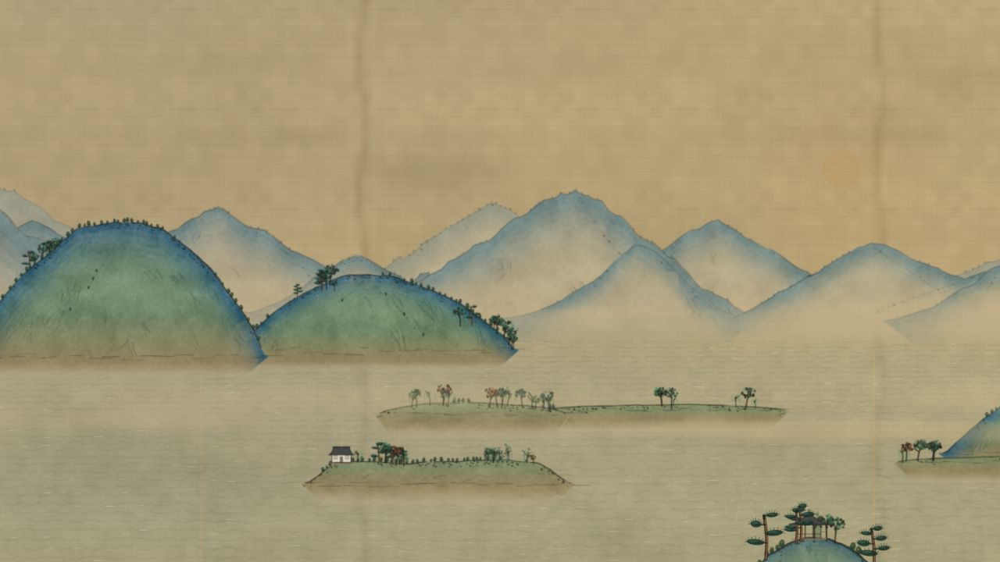

暖色绢纸、蓝绿山体与浅色水面形成清晨景象。近景岛屿和远景群山的尺寸、色彩差异，让二维绘画具有可游览的空间感。

**图 2｜月夜入画：同一山水的时间变化**

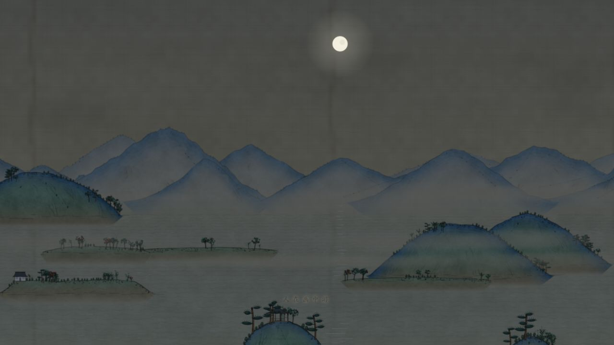

月亮、暗色天空和较冷的山水色调改变画面氛围。昼夜切换重新组织光色，使读者看到同一绘画场景可以随时间变化。

### 汴京一日

这是受《清明上河图》启发的程序绘制长卷。Canvas 绘画步骤可逐渐生成城郊、桥梁和街市；导览用一位送货人的虚构行程连接场景。也可自由拖卷、缩放，点击提示点阅读小故事。

**图 1｜城郊启程：从人物活动进入长卷**

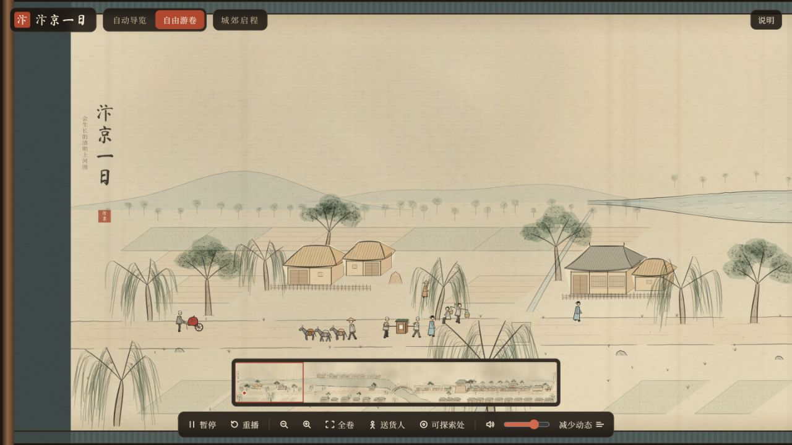

房舍、柳树与行人组成起点。下方缩略导航显示当前可见区域，工具栏提供自动导览、缩放和送货人跟随，便于在长卷中定位。

**图 2｜虹桥相遇：放大后探索小故事**

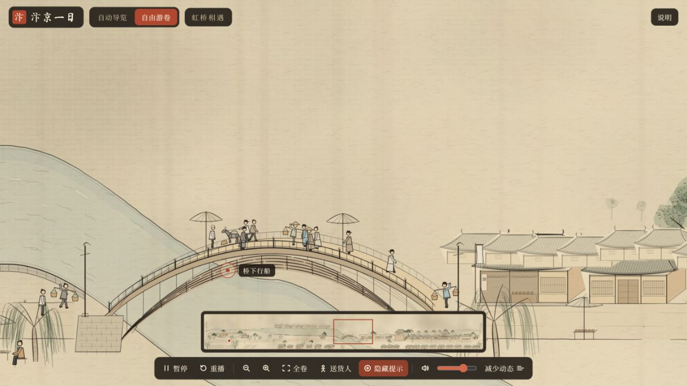

虹桥和桥上的人物成为画面中心，“桥下行船”提示标出可探索内容。空间浏览与故事提示结合，帮助读者从全景走到局部细节。

### 春江花月夜 · 互动网页

十八组诗句与江潮、月亮、落花和舟船等意象一起变化。Canvas 负责场景动画，Web Audio 实时合成乐音与环境声；点击江面可泛起涟漪，移动指针会影响风与落花。

**图 1｜第一联：月出与江潮**

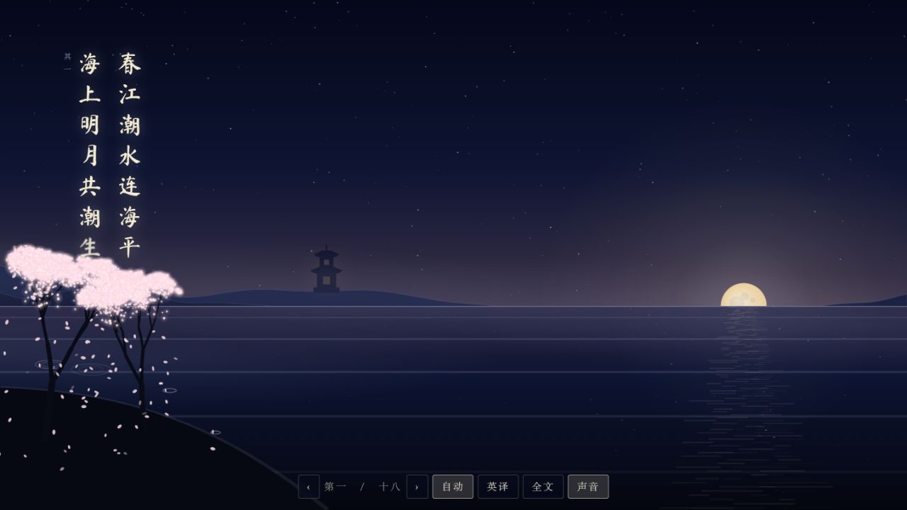

“春江潮水连海平，海上明月共潮生”以竖排文字、江面反光和初升月亮呈现。诗句与景物并置，让意象先以画面进入阅读。

**图 2｜第三联：原文与英译对照**

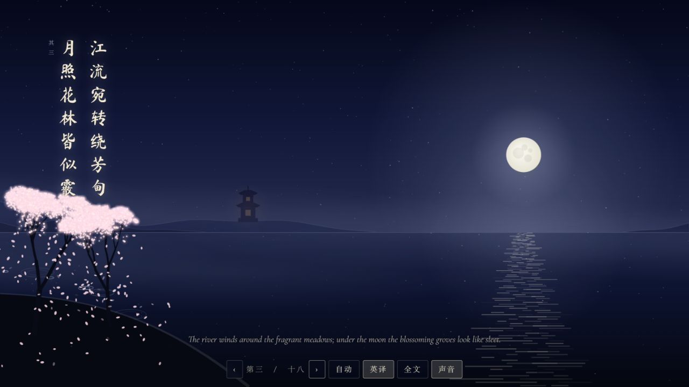

开启“英译”后，英文显示在画面下方；底部可翻到上一联、下一联，也可打开全文。场景动画与双语阅读共用一个界面。

### 春江花月夜 · 视频版

视频以固定时间轴编排月色、江水、诗句与落花，适合直接播放或课堂投影。三个截帧呈现不同阶段的光色与构图；视频本身不包含网页的涟漪、翻页和英译按钮。

**图 1 · 00:55｜月光与水面**

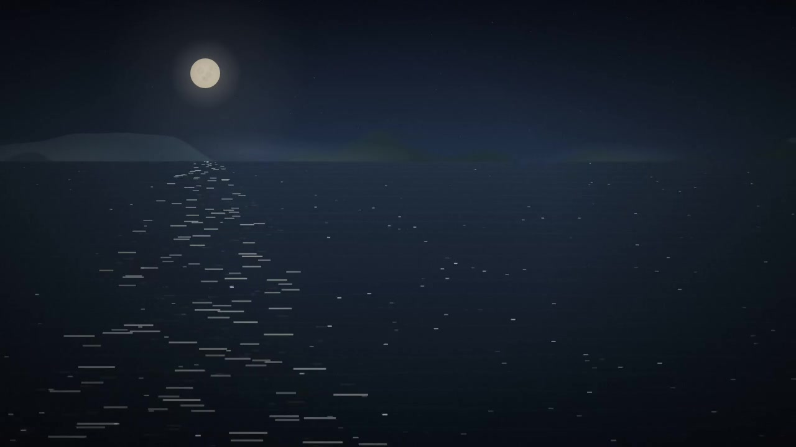

月亮的暖色与深蓝江面形成对比，横向波纹把倒影拉成一条亮带。缓慢的景物运动为诗歌营造安静的观看节奏。

**图 2 · 02:40｜诗句进入画面**

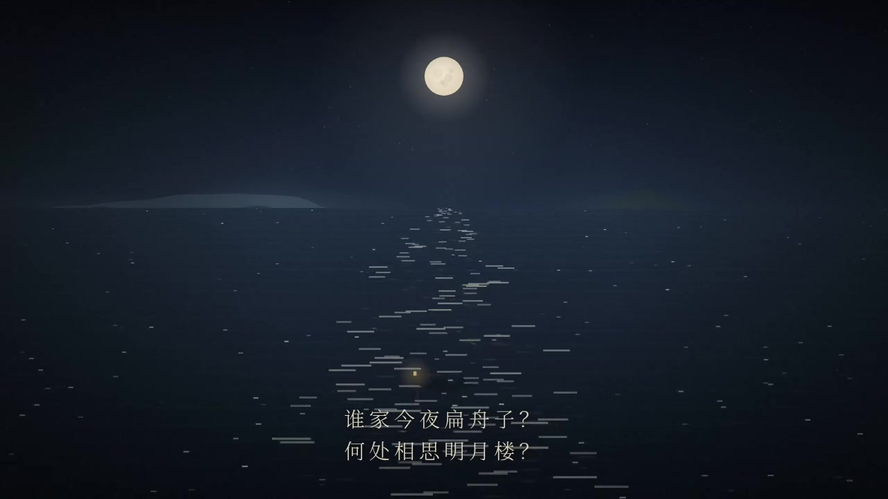

月亮、水中倒影与“谁家今夜扁舟子？何处相思明月楼？”同屏出现，文字将自然景色转入人物与相思的主题。

**图 3 · 05:05｜落花与远月**

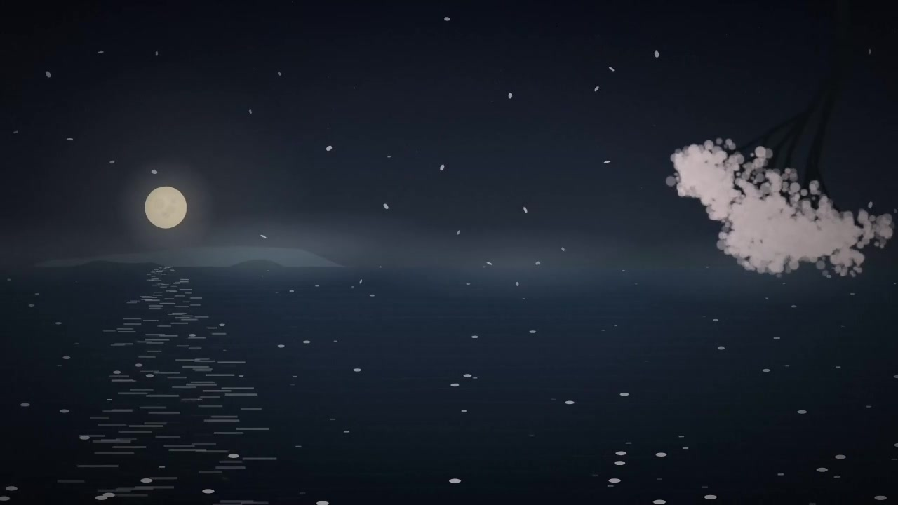

近处枝头和飘落花瓣补充画面层次，远处月亮与江面继续呼应。画面变化让同一夜景具有连续的诗意进程。

### 所剩沾衣

月夜山水由 Canvas 绘制，歌曲直接内嵌在 HTML 中。播放器以音频时间定位歌词、滚动并突出当前句；点击某句歌词可跳转，底部还可微调歌词与歌声的时间差。

**图 1｜歌曲主画面：题字、月色与播放控制**

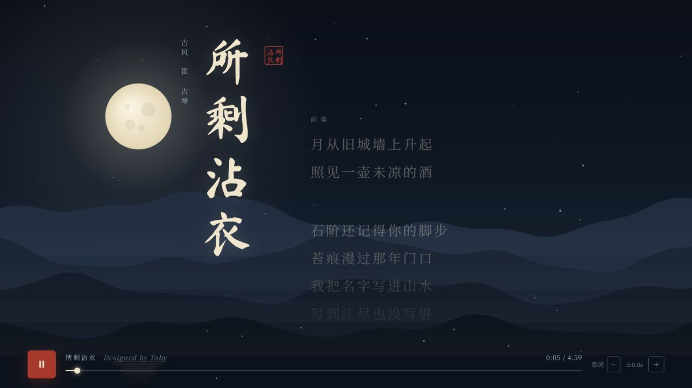

竖排题字与层叠远山建立古风氛围，歌词集中在右侧。底部进度、时长和歌词偏移按钮让视听体验保持清晰的操作入口。

**图 2｜副歌跟随：当前句成为视觉焦点**

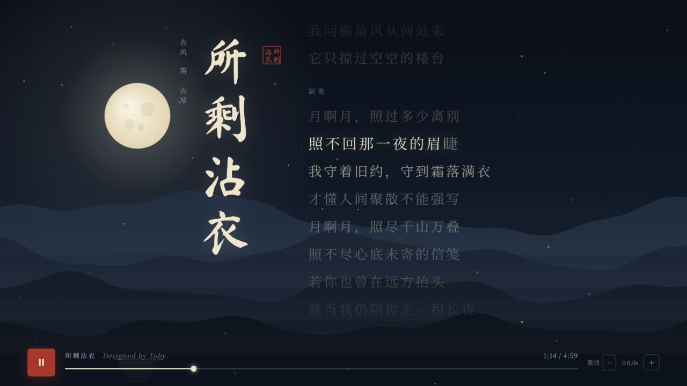

播放到副歌时，当前歌词以较亮文字突出，其余歌词减弱。读者可看到逐句跟随的效果，也能点击歌词直接跳到相应位置。

## 文件入口

- [水墨小品.html](%E6%B0%B4%E5%A2%A8%E5%B0%8F%E5%93%81.html)
- [千里江山·活卷.html](%E5%8D%83%E9%87%8C%E6%B1%9F%E5%B1%B1%C2%B7%E6%B4%BB%E5%8D%B7.html)
- [汴京一日.html](%E6%B1%B4%E4%BA%AC%E4%B8%80%E6%97%A5.html)
- [春江花月夜.html](%E6%98%A5%E6%B1%9F%E8%8A%B1%E6%9C%88%E5%A4%9C.html)
- [春江花月夜_720p.mp4](%E6%98%A5%E6%B1%9F%E8%8A%B1%E6%9C%88%E5%A4%9C_720p.mp4)
- [所剩沾衣_2.html](%E6%89%80%E5%89%A9%E6%B2%BE%E8%A1%A3_2.html)

[返回作品集总览](../README.md)
