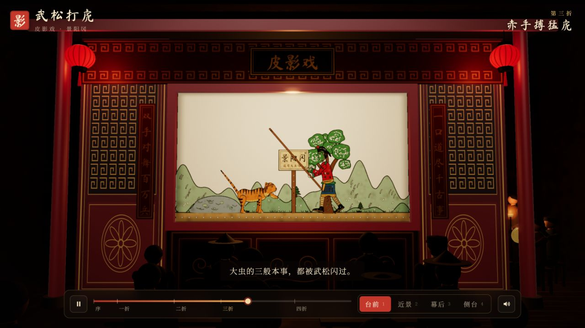
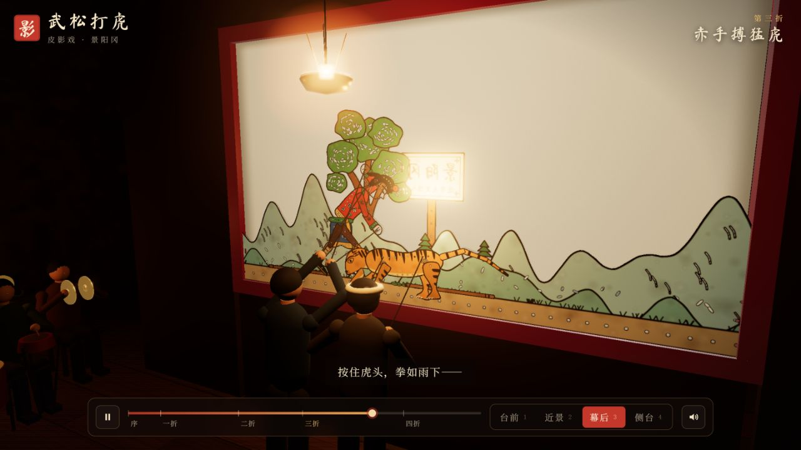
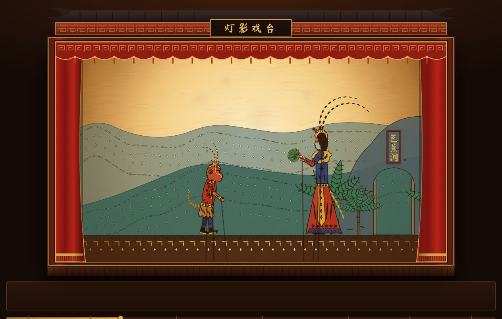
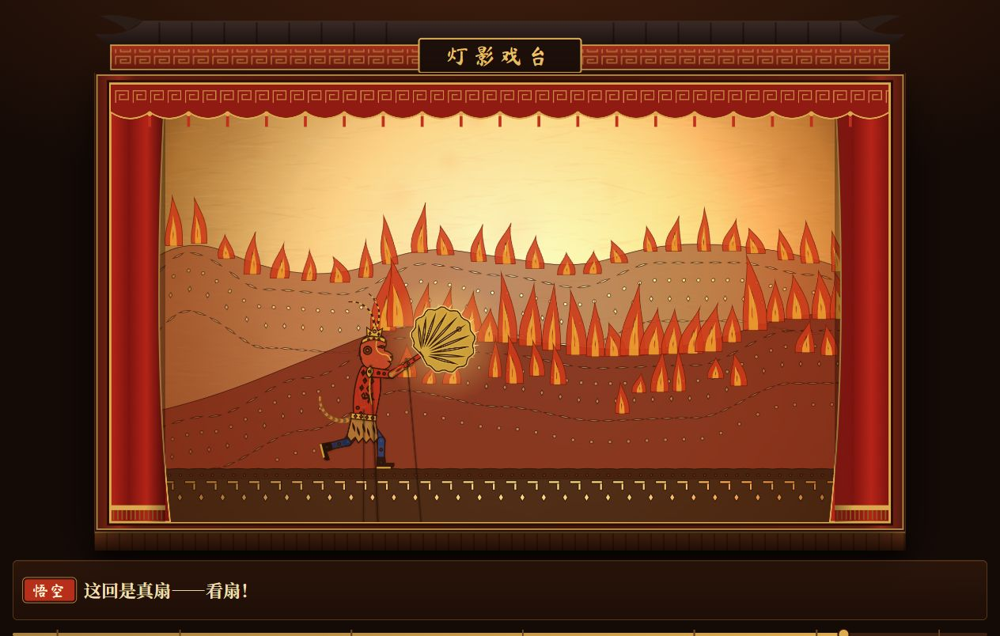

# 皮影戏与故事演出

这组作品以皮影戏为视觉语言，把古典故事转化为浏览器中的演出。《武松打虎》强调舞台空间与观看机位，《孙悟空借芭蕉扇》强调二维角色表演与剧情参与。

## 核心技术

《武松打虎》使用 Three.js 和 WebGL 构建三维戏台。Canvas 绘制的角色和纹理被转换为三维场景中的贴图，分组与关节旋转控制人物动作。渲染目标与自定义着色器处理幕布上的影像，灯光、材质、色调映射和辉光后处理共同形成灯影氛围。OrbitControls 支持旋转、缩放与平移，并提供台前、近景、幕后和侧台四个预设机位。

《孙悟空借芭蕉扇》使用 Canvas 2D 绘制角色、戏幕、火焰、风雨和道具。角色的身体、手臂、腿部和芭蕉扇分别更新，剧情时间轴协调动作、字幕和场景变化。互动模式在关键情节设置等待节点，让观众通过页面操作推动演出；自动模式按编排连续播放。

两部作品都通过 Web Audio API 合成锣鼓或场景音效，让声音跟随动作与剧情事件触发。

## 作品与效果

| 作品 | 呈现与交互 |
| --- | --- |
| 武松打虎 | 立体戏台内呈现皮影演出，观众可从台前、近景、幕后或侧台观看，也可自由环绕观察；支持播放暂停和剧情进度控制。 |
| 孙悟空借芭蕉扇 | 约 3 分 20 秒的故事编排，结合字幕、锣鼓、火焰和风雨特效；可在自动演出与互动体验之间切换。 |

## 观看方式

打开网页后点击开演或播放。《武松打虎》需要支持 WebGL 的浏览器，并在线加载 Three.js 模块；如果直接打开本地文件遇到模块加载限制，可使用本地 HTTP 服务。《孙悟空借芭蕉扇》将主体绘画与演出逻辑放在单个 HTML 中。

## 图文导览

每个展示入口配 2–3 张实拍截图或视频截帧。图注说明当前内容、可观察的效果与体验方法；动态图的截图仅代表一个时刻。

### 武松打虎

Three.js 构建戏台、灯光、人物与皮影幕，配合着色器、辉光和剧情时间轴形成三维演出。四个机位可随时切换；这组截图对比同一打虎章节的观众视角与幕后视角。

**图 1｜台前：赤手搏猛虎**

红色戏台框住发光的影幕，武松和猛虎在幕内行动，前景观众形成观看层次。字幕与进度条帮助读者理解当前剧情和章节位置。

**图 2｜幕后：灯、影幕与操演空间**

切到“幕后”后可以看到灯源、幕布和操演者，角色的皮影形态依然可见。机位变化把舞台效果与实现它的空间关系放在一起。

### 孙悟空借芭蕉扇

Canvas 2D 将皮影角色拆成可运动的部件，并通过时间轴安排场景、字幕和声音。章节选择可以快速跳到关键情节，互动模式则在指定剧情点让观众参与。

**图 1｜第二幕：悟空初见铁扇**

两个人物的侧面造型、装饰花纹、操纵杆和分层山景保留皮影语言。角色动作与对话构成叙事，观众可以切换章节反复观看。

**图 2｜第六幕：真扇灭火**

火焰山铺满火焰，悟空举起芭蕉扇，字幕提示即将扇风。场景、道具和人物动作共同说明当前故事目标。

## 文件入口

- [武松打虎.html](%E6%AD%A6%E6%9D%BE%E6%89%93%E8%99%8E.html)
- [孙悟空借芭蕉扇.html](%E5%AD%99%E6%82%9F%E7%A9%BA%E5%80%9F%E8%8A%AD%E8%95%89%E6%89%87.html)

[返回作品集总览](../README.md)
