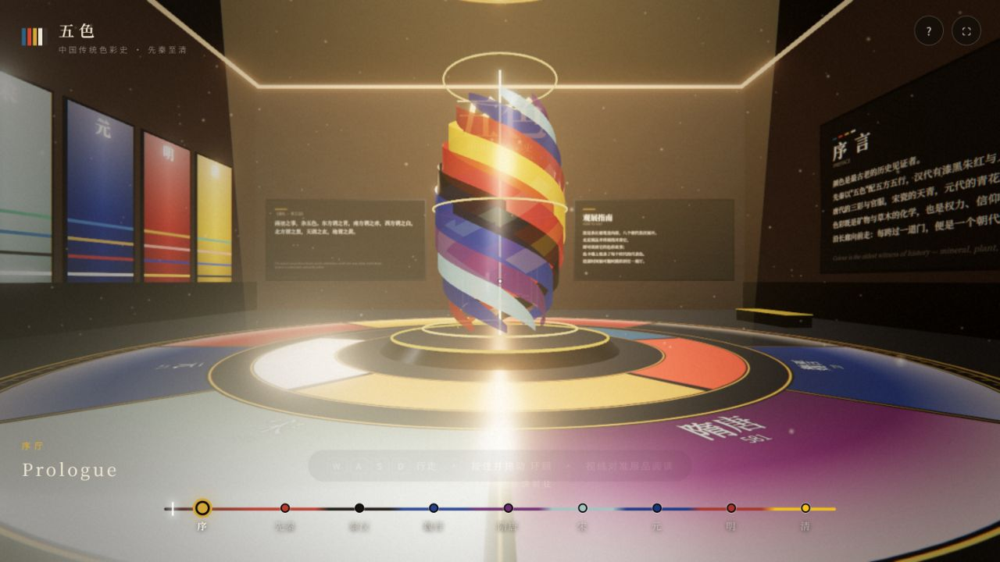
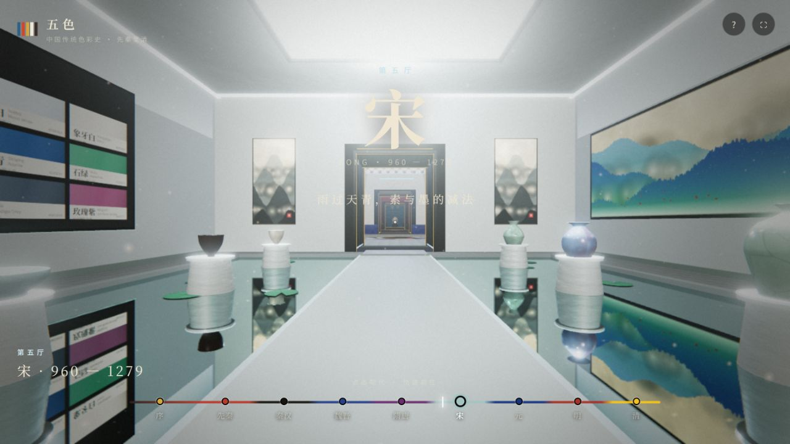
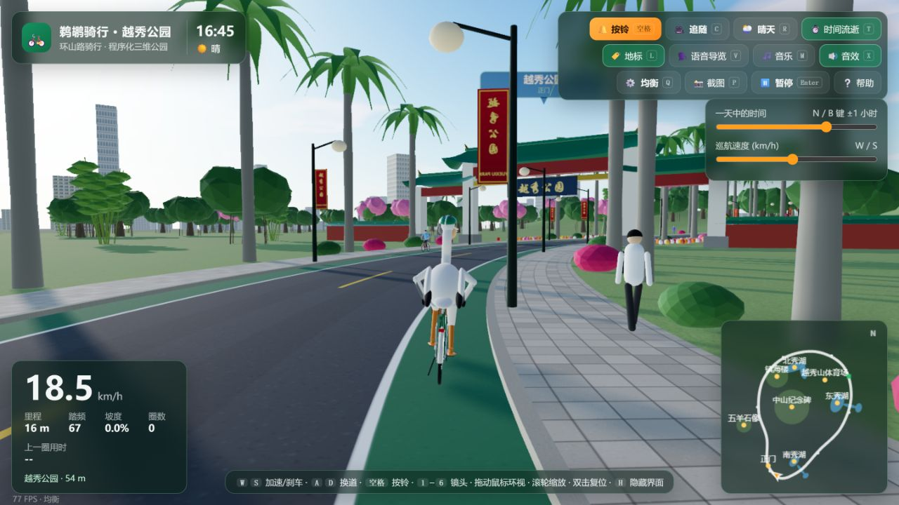
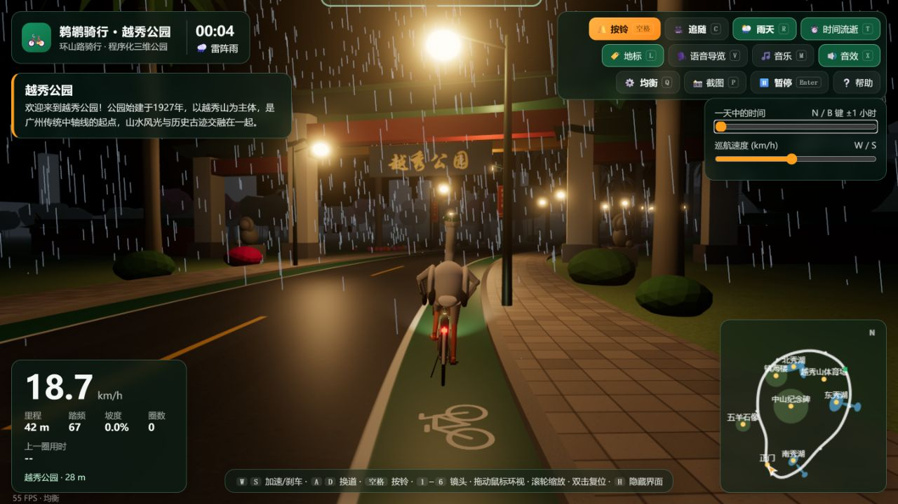
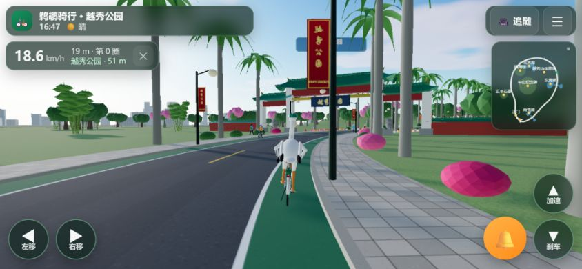
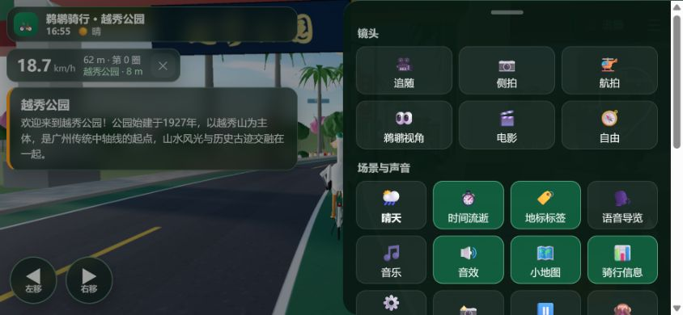
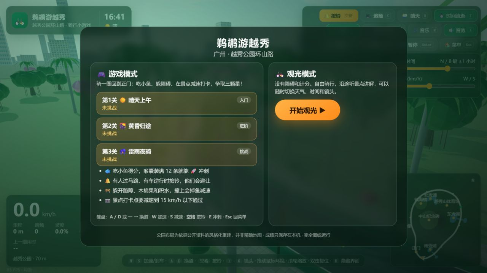
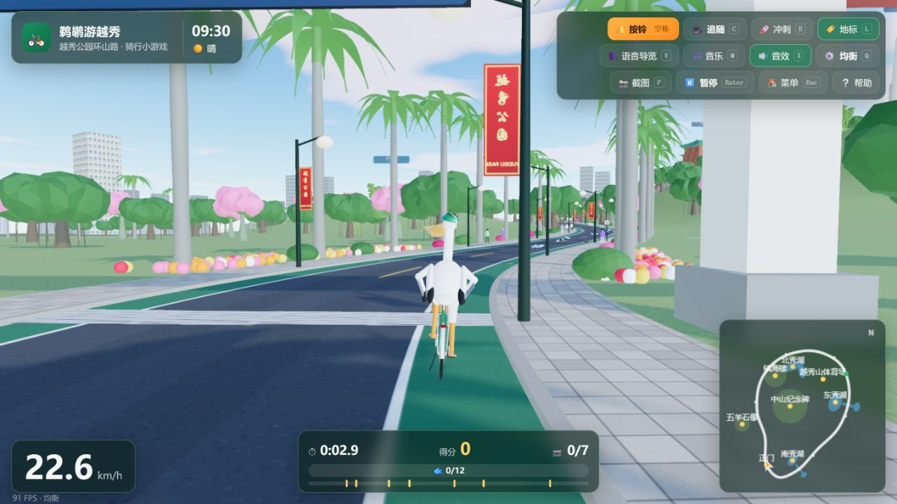
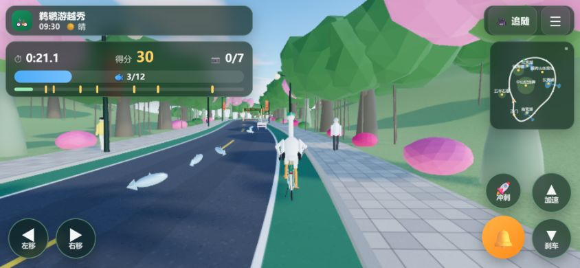
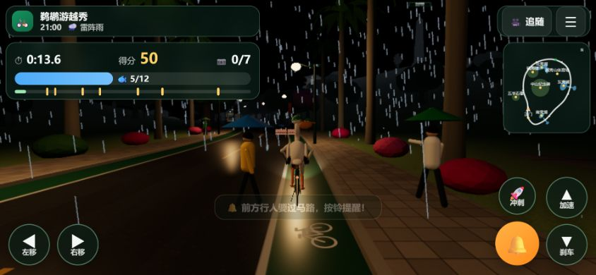

# 三维场景与互动游戏

这组作品将知识展示和游览活动放进实时三维空间。《五色博物馆》沿历史顺序组织展厅，骑行作品则以广州越秀公园为主题，把路线、地标、角色和天气连接成可探索的场景。

## 核心技术

作品使用 Three.js 和 WebGL 绘制三维场景，核心渲染库已打包进 HTML。程序化几何体、材质和 Canvas 纹理用于构建展陈、建筑、地形、树木、器物与角色。实时更新相机和场景对象，让行走、骑行和观察具有连续反馈。

《五色博物馆》提供键盘行走、鼠标环视及触屏摇杆，展品信息与视线目标联动，底部朝代时间轴支持直接前往展厅。骑行作品提供六种镜头、速度与里程显示、昼夜变化、晴天与雷阵雨；Web Audio API 合成环境与动作声音，浏览器语音合成用于地标导览。

《鹈鹕游越秀》在观光模式基础上加入三条车道、鱼的收集、路障与碰撞、按铃避让、冲刺和景点减速打卡。关卡分别设置晴天上午、黄昏归途与雷雨夜骑，成绩通过 localStorage 保存在本机。电脑版用键盘和鼠标控制，手机版加入触屏按钮、滑动和双指缩放。

## 作品与效果

| 作品 | 呈现与交互 |
| --- | --- |
| 五色博物馆 | 从先秦到清代的八个历史展厅，以色柱、器物、展板和壁画组织传统色彩故事；可自由行走或按朝代跳转。 |
| 鹈鹕骑行 越秀公园 | 戴头盔的鹈鹕沿环山路骑行，沿途出现五羊石像、镇海楼等地标；昼夜、天气、灯光与镜头共同改变观看氛围。 |
| 鹈鹕游越秀 游戏版 | 以收集、避障、冲刺和打卡形成任务反馈，提供三关挑战，并保留自由观光模式。 |

## 观看方式

按设备选择电脑或手机版。浏览器需要支持 WebGL；手机横屏更便于观察，首次生成场景可能需要等待。声音需通过点击启动；语音导览的可用语言与声音取决于浏览器和系统。

公园布局是风格化重建，并非精确地图。每个骑行作品的两个设备版本作为同一作品的不同入口，共五个文件、三个作品条目。

## 图文导览

每个展示入口配 2–3 张实拍截图或视频截帧。图注说明当前内容、可观察的效果与体验方法；动态图的截图仅代表一个时刻。

### 五色博物馆

Three.js 把中国传统色彩史组织为可行走的三维展馆，先秦至清的展厅沿时间顺序连接。底部朝代导航可快速前往；WASD 行走、拖动环顾，视线对准展品可阅读说明。

**图 1｜序厅：用空间介绍色彩史**

中央彩色装置与地面分区形成视觉入口，墙面文字和朝代色板交代主题。底部时间轴同时承担历史线索和空间导航。

**图 2｜宋代展厅：器物、色板与山水共同展示**

浅色展厅陈列器物，两侧色板和青绿山水补充语境，地面反射增强空间感。点击“宋”即可从序厅直接进入这一展区。

### 鹈鹕骑行 · 电脑版

程序化三维公园、鹈鹕与自行车由 Three.js 渲染。键盘控制速度、变道与按铃，工具栏可切换六种镜头、天气、时间及声音；地图和仪表帮助观察路线与骑行状态。

**图 1｜晴天追随镜头：边骑行边游览**

镜头跟在鹈鹕身后，正门、行人和道路都处于可观察范围。左下仪表、右下地图与上方工具栏完整呈现电脑版的操作方式。

**图 2｜雨夜：光照与天气共同改变场景**

切换雨天并把时间调到午夜后，路灯、车灯与雨线成为主要视觉元素。相同公园布局呈现出另一种可实时体验的环境。

### 鹈鹕骑行 · 手机版

手机版保留三维骑行与天气、镜头功能，将键盘操作改为屏幕按钮和触摸手势。以下截图使用 844 × 390 的手机横屏视口，展示页面布局；并非手机硬件实测。

**图 1｜横屏骑行：手指可直接操控**

变道按钮在左下，加速、刹车和按铃在右侧。顶部保留时间、镜头与菜单，地图缩小后仍能提供路线信息。

**图 2｜展开菜单：功能集中在侧面面板**

镜头、天气、声音、地图和骑行信息集中在滑出的设置菜单中。主画面仍在背景可见，便于读者理解操作与场景的关系。

### 鹈鹕游越秀 · 电脑版游戏

在三维骑行基础上增加小鱼收集、障碍避让、减速打卡、冲刺与关卡成绩。三条道路位置构成换道玩法；游戏模式和自由观光模式分别提供任务体验与空间浏览。

**图 1｜开始菜单：关卡与任务规则**

晴天、黄昏、雷雨夜骑三个关卡按难度排列，菜单说明收鱼、按铃、避障和打卡规则。读者可先选择挑战或直接进入观光。

**图 2｜实际游玩：计分与路线同时可见**

底部计时、得分、打卡数量和鱼量显示任务状态，工具栏保留按铃与冲刺。公园景物作为可游览空间，也成为游戏路线。

### 鹈鹕游越秀 · 手机版游戏

游戏规则与电脑版一致，屏幕按钮与左右滑动承担变道，加速、刹车、按铃和冲刺均有触控入口。两图使用 844 × 390 手机横屏视口，分别展示晴天与雷雨关卡。

**图 1｜晴天收鱼：任务反馈与触控按钮**

小鱼沿道路分布，左上面板显示计时、得分、打卡数和喉囊鱼量。左右两侧按钮让读者看到游戏如何在触屏布局中操作。

**图 2｜雷雨夜骑：环境成为挑战的一部分**

雨线、路灯和行人构成夜间关卡，屏幕提示“前方行人要过马路，按铃提醒”。天气变化与任务提示共同影响游玩节奏。

## 文件入口

- [五色博物馆.html](%E4%BA%94%E8%89%B2%E5%8D%9A%E7%89%A9%E9%A6%86.html)
- [鹈鹕骑行_越秀公园_电脑版_1.html](%E9%B9%88%E9%B9%95%E9%AA%91%E8%A1%8C_%E8%B6%8A%E7%A7%80%E5%85%AC%E5%9B%AD_%E7%94%B5%E8%84%91%E7%89%88_1.html)
- [鹈鹕骑行_越秀公园_手机版.html](%E9%B9%88%E9%B9%95%E9%AA%91%E8%A1%8C_%E8%B6%8A%E7%A7%80%E5%85%AC%E5%9B%AD_%E6%89%8B%E6%9C%BA%E7%89%88.html)
- [鹈鹕游越秀_游戏版_电脑版.html](%E9%B9%88%E9%B9%95%E6%B8%B8%E8%B6%8A%E7%A7%80_%E6%B8%B8%E6%88%8F%E7%89%88_%E7%94%B5%E8%84%91%E7%89%88.html)
- [鹈鹕游越秀_游戏版_手机版.html](%E9%B9%88%E9%B9%95%E6%B8%B8%E8%B6%8A%E7%A7%80_%E6%B8%B8%E6%88%8F%E7%89%88_%E6%89%8B%E6%9C%BA%E7%89%88.html)

[返回作品集总览](../README.md)
