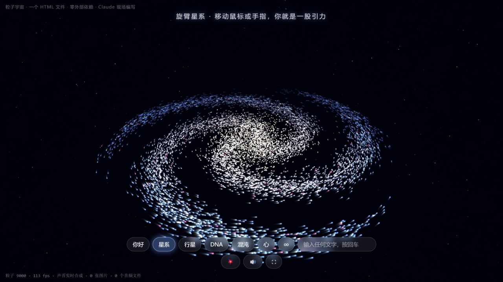
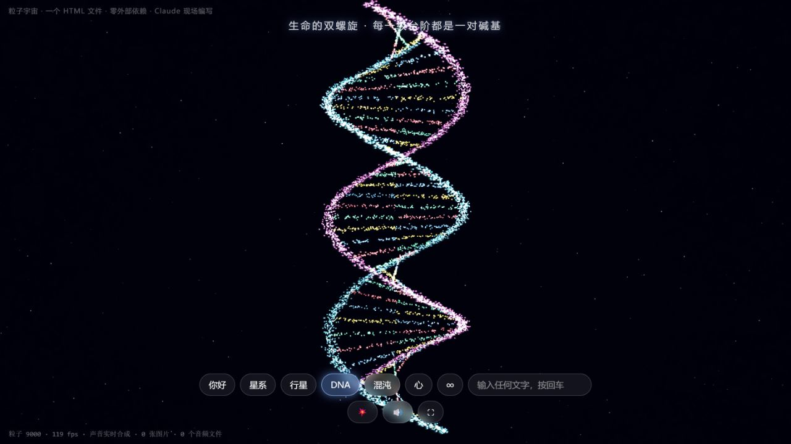

# 粒子生成艺术

《粒子宇宙》以粒子的聚合、分散与变形展现不同的数学和自然意象。连续的点阵运动将星系、星球、DNA、洛伦兹吸引子、心形与文字连接起来，让同一组粒子在不同形态之间转换。

## 核心技术

画面使用 Canvas 2D 绘制，三维粒子坐标经过旋转与透视投影映射到二维画布。因此它呈现三维空间感，但没有使用 Three.js 或 WebGL 渲染。

粒子的位置、速度、目标坐标与颜色存储在 Float32Array 中。数学函数和随机采样生成目标形态，运动与颜色插值让点阵渐变成新的图形；文字形态通过离屏 Canvas 的像素采样获得。根据屏幕尺寸，代码使用约 4500 或 9000 个粒子。

Web Audio API 通过振荡器、滤波、延迟和音量包络生成背景音与转场音。图形和声音都在浏览器中实时生成，主体功能没有外部资源依赖。

## 呈现效果

粒子在旋转、投影、轨迹和色彩变化中产生纵深与流动感。不同形态之间的过渡展示了数学描述如何转化为可感知的图像，适合生成艺术、数学可视化或创意编程展示。

## 观看方式

打开 HTML 后点击进入。建议全屏并开启声音；小屏幕会采用较少粒子以降低绘制负担。

## 图文导览

每个展示入口配 2–3 张实拍截图或视频截帧。图注说明当前内容、可观察的效果与体验方法；动态图的截图仅代表一个时刻。

### 粒子宇宙

Canvas 2D 将三维数学坐标投影到屏幕，数千粒子在星系、行星、DNA、混沌、心形与文字之间过渡。移动指针可影响粒子运动，声音由 Web Audio 实时合成，作品无需外部图片或音频文件。

**图 1｜旋臂星系：粒子构成空间**

明亮中心与旋臂共同形成星系，疏密与亮度提供深度线索。界面提示指针可以作为引力影响运动，观看者能够参与形态变化。

**图 2｜DNA：同一批粒子的另一种组织**

粒子排列成双螺旋和横向连接，颜色区分不同部分。点击底部形态按钮即可转换，展示数学坐标如何生成不同视觉结构。

## 文件入口

- [粒子宇宙.html](%E7%B2%92%E5%AD%90%E5%AE%87%E5%AE%99.html)

[返回作品集总览](../README.md)
