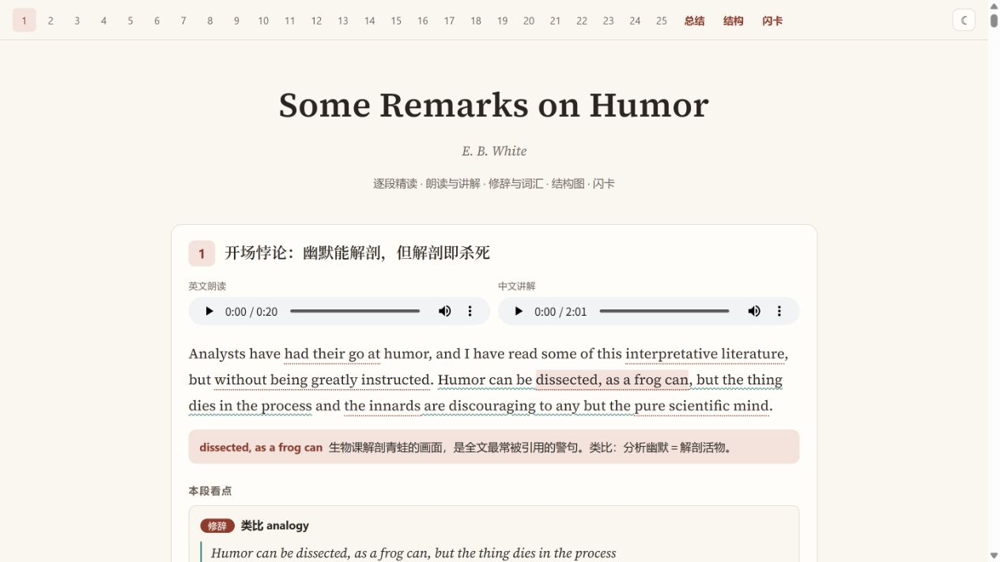
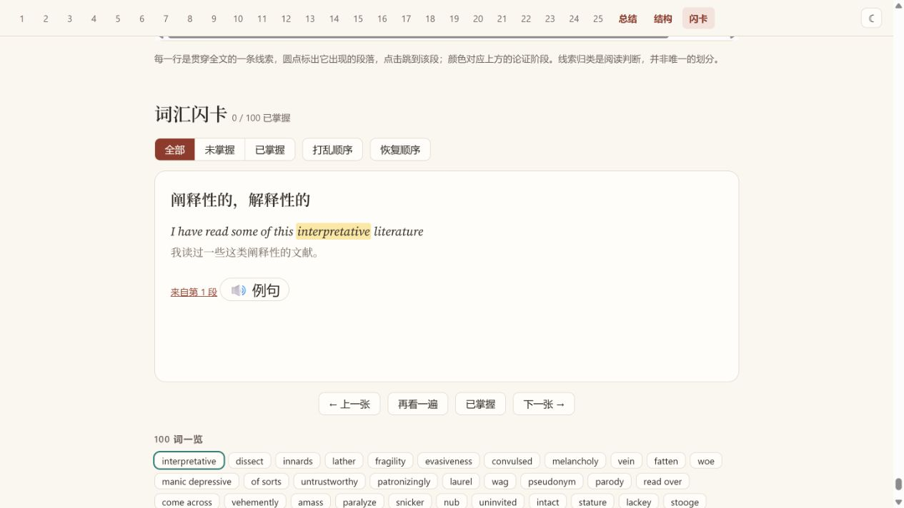
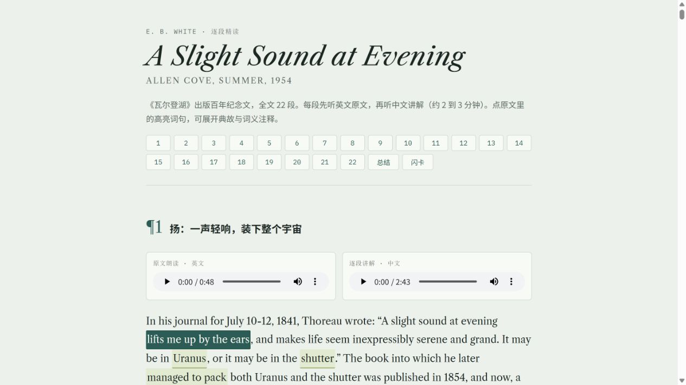
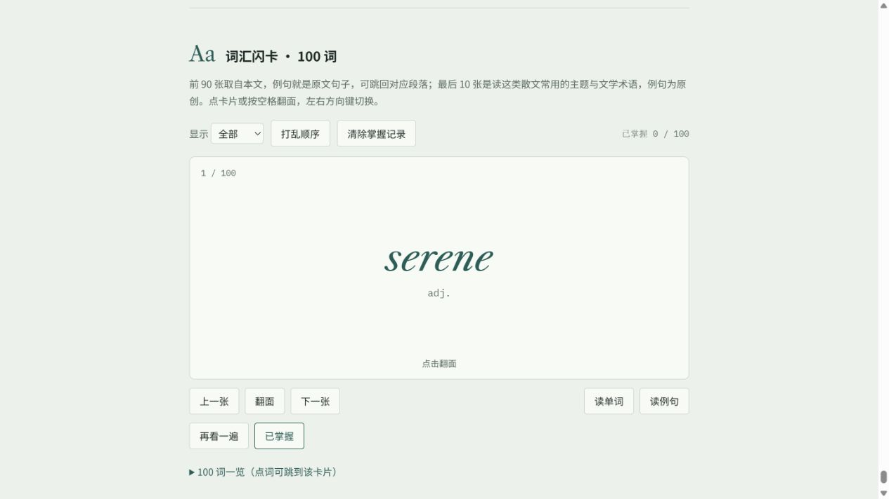
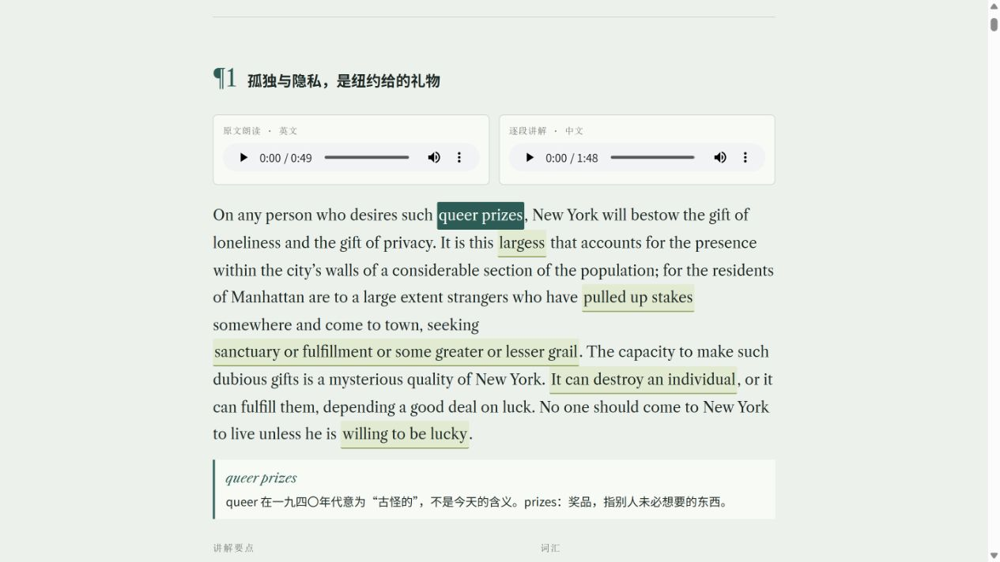
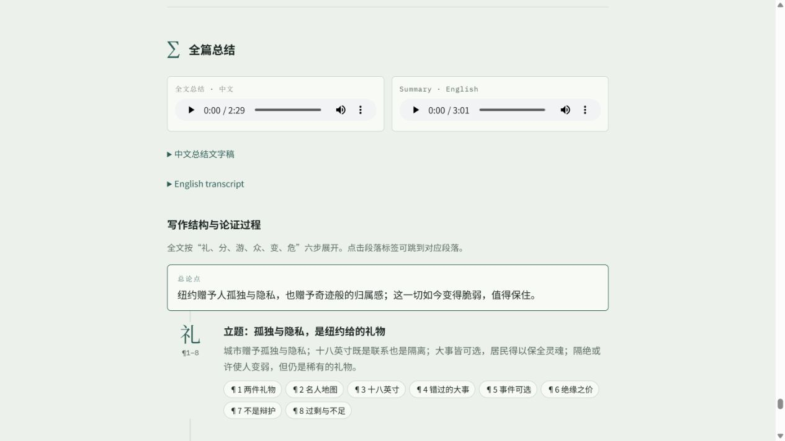

# 英语文学精读与学习工具

这组作品以 E. B. White 的散文为中心，将全文阅读拆成可定位、可听读、可复习的段落。读者在同一页面中查看原文，听英文朗读与中文讲解，再通过高亮注释理解词汇、典故和修辞。

## 核心技术

页面使用 HTML、CSS 和 JavaScript 构建，段落内容、注释、词汇及讲解数据与内嵌音频保存在单个 HTML 文件中。HTML audio 控件播放英文朗读和中文讲解，点击高亮词句展开补充说明，段落导航帮助读者定位原文。

闪卡将单词、短语及例句组织为复习界面，localStorage 保存已掌握词汇；《散文阅读》还保存明暗主题，并通过 IntersectionObserver 跟随阅读位置更新导航。浏览器 speechSynthesis 用于词汇或例句发音，与预先内嵌的段落朗读音频是两条不同的声音路径。

## 作品与效果

| 文件 | 实际内容 | 学习功能 |
| --- | --- | --- |
| 散文阅读.html | Some Remarks on Humor，25 段 | 原文、朗读与讲解，修辞分析、词汇、总结、结构图和闪卡。 |
| 瓦尔登湖.html | A Slight Sound at Evening，22 段 | E. B. White 为《瓦尔登湖》出版百年写的纪念散文，提供逐段精读、典故注释、讲解和闪卡。 |
| Here_Is_New_York_full.html | Here Is New York，46 段 | 围绕纽约的城市经验展开全文精读，将地名、人物与文化典故连接到段落理解。 |

原文与讲解紧邻呈现，便于听读和回看；注释减少在多个资料之间跳转，闪卡将阅读中遇到的词汇转为复习内容。这些是页面提供的学习支持，不代表已经测量了学习成绩提升。

## 使用方式

下载 HTML 后在浏览器打开，选择段落并点击音频播放。文件较大是因为包含音频，首次打开需要等待。已掌握词汇只存储在当前浏览器本机；系统语音取决于浏览器和操作系统。文件名“瓦尔登湖”保留原名称，内容不是梭罗《瓦尔登湖》全书。

## 图文导览

每个展示入口配 2–3 张实拍截图或视频截帧。图注说明当前内容、可观察的效果与体验方法；动态图的截图仅代表一个时刻。

### Some Remarks on Humor · 散文阅读

25 段原文配英文朗读、中文讲解、词句注释和修辞分析。HTML/CSS 组织阅读界面，内嵌音频支持离线学习，JavaScript 处理注释与翻卡；掌握记录保存在本机。

**图 1｜逐段精读：声音、原文与注释同屏**

点击“dissected, as a frog can”展开青蛙类比的解释，下方接续修辞看点。两个音频入口分别负责英文朗读和中文讲解。

**图 2｜翻卡复习：词义回到原文语境**

翻面后显示词义、原句、译文与来源段落；“再看一遍”“已掌握”和筛选帮助安排复习。100 词一览提供快速跳转。

### A Slight Sound at Evening · 瓦尔登湖纪念文

文件名为“瓦尔登湖”，实际内容是 E. B. White 的 22 段百年纪念文章。原文朗读、中文讲解、可展开注释与 100 张词卡构成从阅读到复习的学习路径。

**图 1｜文章导读与第一段：先建立阅读背景**

顶部明确文章写作背景和段落数量，段落导航紧接其后。第一段并排提供英文与中文音频，原文中的高亮词句可以点击解释。

**图 2｜100 张词卡：检查词义与用法**

正面先显示英文单词和词性，点击翻面可查看释义与原句；还可朗读、打乱顺序、筛选或标记掌握。例句与对应段落关联。

### Here Is New York

46 段城市散文配逐段双语音频与词句注释。总结区把长文整理为论点和分阶段的写作结构，段落标签可跳回原文；词卡继续承担词汇复习。

**图 1｜原文精读：在具体句子中解释词义**

第一段围绕纽约的孤独与隐私展开。“queer prizes”的注释说明旧时代词义，帮助读者结合写作年代理解表达。

**图 2｜全篇总结：从段落回到论证过程**

中英总结音频之后，结构区按“礼、分、游、众、变、危”组织全篇。论点框和可点击段落标签把长文变成可回溯的阅读路径。

## 文件入口

- [散文阅读.html](%E6%95%A3%E6%96%87%E9%98%85%E8%AF%BB.html)
- [瓦尔登湖.html](%E7%93%A6%E5%B0%94%E7%99%BB%E6%B9%96.html)
- [Here_Is_New_York_full.html](Here_Is_New_York_full.html)

[返回作品集总览](../README.md)
