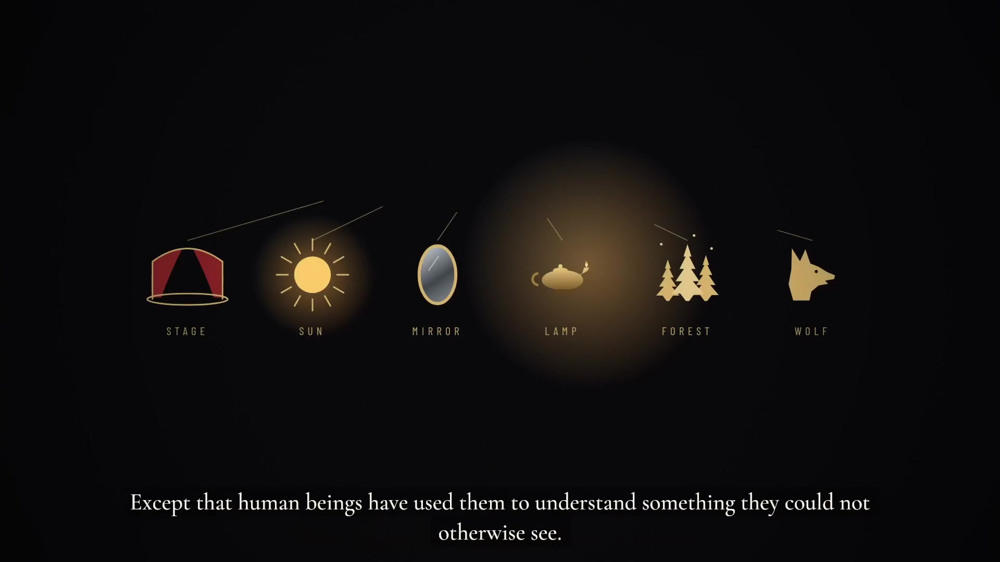
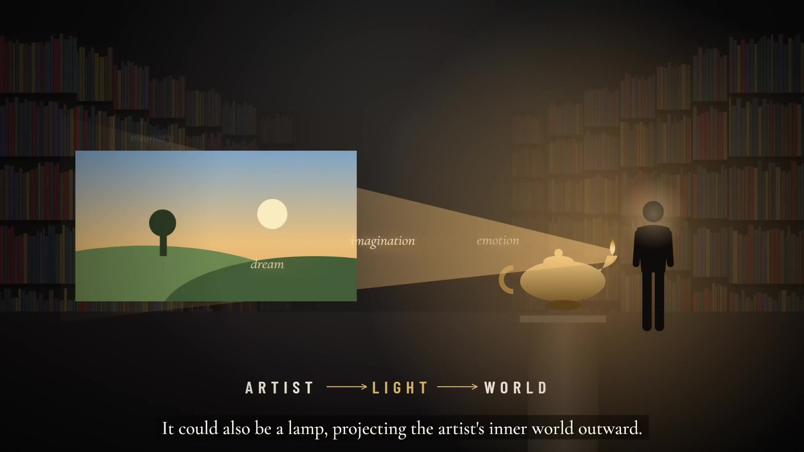
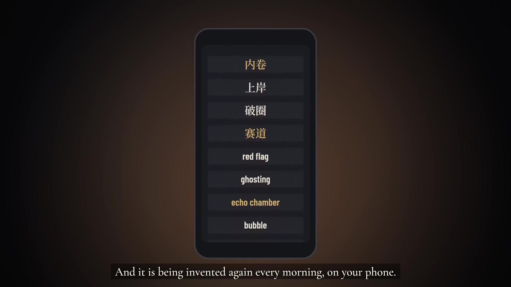
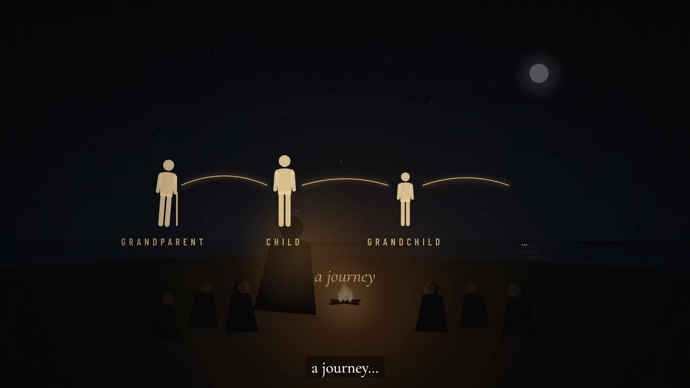
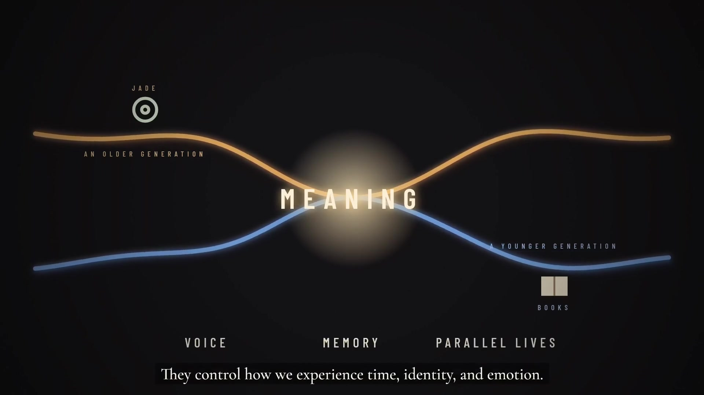
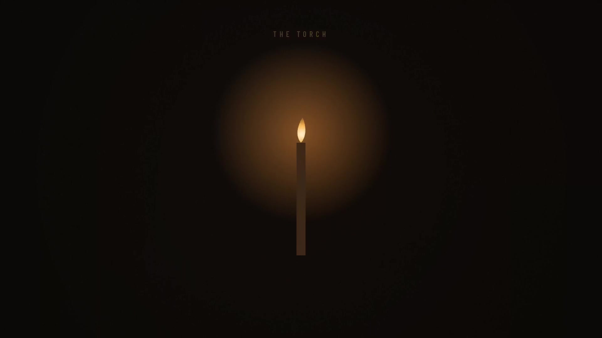

# 动态教学与知识短片

这组短片分别围绕配色、隐喻与故事表达展开。它们以时间顺序安排概念、案例和解释，让画面与声音共同推进内容，适合课堂导入、概念讲解和讨论前的观看。

## 内容与呈现效果

| 作品 | 主题与视觉表达 | 时长 |
| --- | --- | --- |
| 让 AI 画得更好看 文生图中的色彩搭配 | 用色环、配色样例和设计案例说明色彩关系。例如同类色通过同一色相的深浅变化形成统一的视觉风格。 | 3 分 01 秒 |
| METAPHOR The Worlds We Think Inside | 以场景和概念映射解释隐喻如何组织理解。例如将“人生”映射为“剧场”，对应出生与入场、身份与角色、行为与表演。 | 5 分 52 秒 |
| STORYTELLING From Homer to Steve Jobs | 将故事表达置于历史与文化语境中，用人物符号和场景呈现神话中的骄傲、牺牲、命运等抽象概念。 | 6 分 26 秒 |

配色短片让色彩关系有具体的参照，隐喻短片让概念之间的对应可见，故事短片用人物与情境承载抽象意义。字幕为关键解释提供文字线索，连续编排帮助观看者沿着统一节奏理解内容。

## 技术与文件格式

三部成片均为 1920 × 1080、30 帧每秒的 MP4，视频采用 H.264 编码，音频采用 AAC 编码，可由常见浏览器和播放器播放。动态图解、场景编排、字幕以及音画配合是成片中可观察到的表现手段。

本目录提供视频成片。具体动画、绘图、配音与剪辑软件需以制作工程为准，不能仅凭画面确定所用模型或工具。时长按文件元数据四舍五入到秒。

## 观看方式

下载 MP4 后用浏览器或播放器播放。这些文件是固定时长视频，交互由播放器的播放、暂停和进度控制提供。《春江花月夜》的视频归入“数字水墨与诗意视听”，与其互动网页放在同一类别。

## 图文导览

每个展示入口配 2–3 张实拍截图或视频截帧。图注说明当前内容、可观察的效果与体验方法；动态图的截图仅代表一个时刻。

### 让 AI 画得更好看 · 文生图中的色彩搭配

以色板、色环、包装案例和提示词示范解释配色。动态图解将色彩关系、面积分配和语言描述连接起来，帮助读者把审美观察转成可执行的文生图提示。成片为 1080p、30 fps，H.264/AAC。

**图 1 · 00:25｜主色、辅助色与点缀色**

包装案例旁列出三种颜色的角色，画面说明最大面积主色决定整体氛围。读者可先从颜色的用途与比例理解画面。

**图 2 · 01:20｜互补色：色环到实际案例**

蓝与橙在色环和右侧包装中对应出现，字幕强调蓝色大面积主导、橙色少量强调。抽象色彩关系通过具体设计得到解释。

**图 3 · 02:25｜把配色写进文生图提示词**

案例将颜色名称、使用位置与面积关系组织为文字描述，旁边保留目标画面。读者可以对照提示词和配色结果理解写法。

### METAPHOR · The Worlds We Think Inside

以发光物件、空间场景、关系箭头和字幕解释隐喻。知识被组织为一段可连续观看的视觉论证，适合在隐喻或表达课程中作为讨论材料。成片为 1080p、30 fps，H.264/AAC；具体制作工具无法由成片单独确定。

**图 1 · 00:30｜具体物象：从可见事物理解抽象概念**

一排不同物件在暗色空间中依次出现，字幕说明人类借它们理解原本难以理解的内容。简化形象为概念比较提供参照。

**图 2 · 02:30｜艺术家—光—世界：让概念关系可见**

灯向画面投射光线，人物位于旁边，文字排列为 ARTIST → LIGHT → WORLD。光的方向把“向外投射内在世界”的解释转成空间关系。

**图 3 · 04:50｜手机中的隐喻：语言继续演变**

手机屏幕列出“拉黑、上岸、破圈、赛道”以及 red flag、ghosting 等表达，字幕指出隐喻仍在日常使用中被创造。它将概念讨论连接到读者熟悉的语言。

### STORYTELLING · From Homer to Steve Jobs

人物图标、运动路径、概念线条与字幕共同讲述故事表达。简化的视觉符号让观众把注意力放在人物关系、意义与传递上，适合用于叙事课程的导入和讨论。成片为 1080p、30 fps，H.264/AAC。

**图 1 · 00:30｜旅程：把生命阶段连成叙事**

祖辈、孩子与孙辈由弧线连接，字幕以 journey 概括进程。人物与路径让时间和代际关系成为可见的故事骨架。

**图 2 · 03:00｜意义：两条路径在中心汇合**

不同颜色的曲线靠近 MEANING，旁边配符号与文字。字幕指出故事影响我们体验时间、身份和情感的方式，抽象解释由线条关系承载。

**图 3 · 05:40｜火炬：用单一意象收束尾段**

画面以暗背景中的发光火炬聚焦注意力，标题 THE TORCH 呼应传递的意象。减少画面元素后，视觉节奏转向停顿与思考。

## 文件入口

- [让AI画得更好看_文生图中的色彩搭配.mp4](%E8%AE%A9AI%E7%94%BB%E5%BE%97%E6%9B%B4%E5%A5%BD%E7%9C%8B_%E6%96%87%E7%94%9F%E5%9B%BE%E4%B8%AD%E7%9A%84%E8%89%B2%E5%BD%A9%E6%90%AD%E9%85%8D.mp4)
- [METAPHOR-The-Worlds-We-Think-Inside.mp4](METAPHOR-The-Worlds-We-Think-Inside.mp4)
- [STORYTELLING-From-Homer-to-Steve-Jobs.mp4](STORYTELLING-From-Homer-to-Steve-Jobs.mp4)

[返回作品集总览](../README.md)
